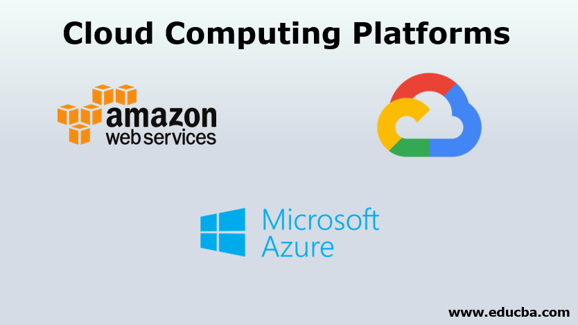

.. _DEST configuration and build:

.. DEST configuration and build
.. ============

DEST configuration and build
===================

In the following we will provide an example on how to configure and build DEST on a local/remote machine.

DEST on ARCHER2
===================

After being successfully logged into the cluster, first export the following and load modules:

    .. code-block:: console
		
		export CRAY_ADD_RPATH=yes
                module swap PrgEnv-cray PrgEnv-gnu 
                module load cray-fftw
		module load cmake/3.21.3
		
Custom Environments 
==================

Regardless of the existing python environment on the HPC/local system, you need to setup a custom Python environment including packages that are not in the central installation, the simplest approach here would be the installation of Miniconda locally in your own directories.

Installing Miniconda
==================
.. image:: ../../images/ac.png
   :alt: Miniconda
   :target: https://docs.conda.io/en/latest/miniconda.html
   :class: with-shadow
   :scale: 30

First, you should download Miniconda (links to the various miniconda versions on the Miniconda website: https://docs.conda.io/en/latest/miniconda.html)

.. Note:: If you wish to use Python on the Archer2's compute nodes then you must install Miniconda in your /work directories as these are the only ones visible on the compute nodes.

Once you have downloaded the installer, you can run it. 
For example:

    .. code-block:: console
		
		user@login*:~> bash Miniconda3-latest-Linux-x86_64.sh
		
After you have installed Miniconda and setup your environment to access it, after that you can install whatever packages you wish using the conda install ... command. 
For example create the following environment: 

    .. code-block:: console
		
		(base)user@login*:~> conda create -n py3_32
		(base)user@login*:~> conda activate py3_32
		(py3_32)user@login*:~> conda config --env --set subdir linux-32
		(py3_32)user@login*:~> conda install python=3 gxx_linux-32
		(py3_32)user@login*:~> conda install -c conda-forge ninja

Enter the work directory (/work) and clone the DEST code into a folder, e.g. DEST-master

    .. code-block:: console
		
		cd work/e723/e723/yours
                git clone https://gitlab.DEST_master 

After the code is cloned, enter the DEST folder, make a build directory and enter it
    .. code-block:: console
		
		cd DEST-master
                cd BIN

From within the build directory, run the configure command (with updated path!). Note the use of CC and CXX to select the special ARCHER-specific compilers (py3_32 environment).

    .. code-block:: console
		
	cmake -G "Ninja"   -DCMAKE_BUILD_TYPE:STRING="Debug" -DCMAKE_INSTALL_PREFIX:PATH="/mnt/lustre/a2fs-work2/work/e723/e723/kevinb/DEST-master/src/install"  -DCMAKE_C_COMPILER="/mnt/lustre/a2fs-work2/work/e723/e723/kevinb/miniconda3/envs/P32/bin/i686-conda_cos6-linux-gnu-cc" -DCMAKE_CXX_COMPILER="/mnt/lustre/a2fs-work2/work/e723/e723/kevinb/miniconda3/envs/P32/bin/i686-conda_cos6-linux-gnu-c++"  /mnt/lustre/a2fs-work2/work/e723/e723/kevinb/DEST-master/src/CMakeLists.txt

i686-conda_cos6-linux-gnu-cc and i686-conda_cos6-linux-gnu-c++ are the C and C++ wrappers for the Cray utilities and determined by the Miniconda py3_32 environment.
SYSTEM_BLAS_LAPACK is disabled since, by default, we can use the libsci package which contains an optimized version of BLAS and LAPACK and not require any additional arguments to cc.

At this point you can run cmake .. to e.g. disable unnecessary solvers, then run cmake as usual to build the code (with updated path!)

    .. code-block:: console
		
		cmake --build /mnt/lustre/a2fs-work2/work/e723/e723/kevinb/DEST-master/src  --clean-first  --config Debug -- "-v"
		
Then check the executable file

    .. code-block:: console
    
		file DEST_analyser_Debug

For testing the executable file you can run the following:
    .. code-block:: console
		
		./DEST_analyser_Debug   -filename ../TESTS/B_013/B_013.dat
    

DEST on ARC
===================

After being successfully logged into the cluster, first export the following and load modules:

    .. code-block:: console
		
		module load CMake/3.23.1-GCCcore-11.3.0
                module load Ninja/1.10.2-GCCcore-11.2.0
		
Method one
==================
Using Miniconda

Custom Environments 
==================

Regardless of the existing python environment on the HPC/local system, you need to setup a custom Python environment including packages that are not in the central installation, the simplest approach here would be the installation of Miniconda locally in your own directories.

Installing Miniconda
==================
.. image:: ../../images/ac.png
   :alt: Miniconda
   :target: https://docs.conda.io/en/latest/miniconda.html
   :class: with-shadow
   :scale: 30

First, you should download Miniconda (links to the various miniconda versions on the Miniconda website: https://docs.conda.io/en/latest/miniconda.html)

.. Note:: If you wish to use Python on the ARC's compute nodes then you must install Miniconda in your /work directories as these are the only ones visible on the compute nodes.

Once you have downloaded the installer, you can run it. 
For example:

    .. code-block:: console
		
		user@login*:~> bash Miniconda3-latest-Linux-x86_64.sh
		
After you have installed Miniconda and setup your environment to access it, after that you can install whatever packages you wish using the conda install ... command. 
For example create the following environment: 
    .. code-block:: console
		
		(base)user@login*:~> conda create -n py3_32
		(base)user@login*:~> conda activate py3_32
		(py3_32)user@login*:~> conda config --env --set subdir linux-32
		(py3_32)user@login*:~> conda install python=3 gxx_linux-32

Enter your work directory (/data) and clone the DEST code into a folder, e.g. DEST-master

    .. code-block:: console
		
		cd /data/engsci-impact-eng-lab/yours
                git clone https://gitlab.DEST_master 

After the code is cloned, enter the DEST folder, make a build directory and enter it (cd ../BIN)
    .. code-block:: console
		
		cd DEST-master
                cd src/BIN

From within the build directory, run the configure command (with updated path!). Note the use of CC and CXX to select the special ARC-specific compilers (py3_32 environment).

    .. code-block:: console
		
	cmake -G "Ninja"   -DCMAKE_BUILD_TYPE:STRING="Debug" -DCMAKE_INSTALL_PREFIX:PATH="/data/engsci-impact-eng-lab/engs2454/DEST-master_32/src/install"  -DCMAKE_C_COMPILER="/data/engsci-impact-eng-lab/engs2454/miniconda3/envs/py3_32/bin/i686-conda_cos6-linux-gnu-cc"  -DCMAKE_CXX_COMPILER="/data/engsci-impact-eng-lab/engs2454/miniconda3/envs/py3_32/bin/i686-conda_cos6-linux-gnu-c++"  /data/engsci-impact-eng-lab/engs2454/DEST-master_32/src/CMakeLists.txt

i686-conda_cos6-linux-gnu-cc and i686-conda_cos6-linux-gnu-c++ are the C and C++ wrappers for the Cray utilities and determined by the Miniconda py3_32 environment.

At this point you can run cmake .. to e.g. disable unnecessary solvers, then run cmake as usual to build the code (with updated path!)

    .. code-block:: console
		
		cmake --build /data/engsci-impact-eng-lab/engs2454/DEST-master_32/src/BIN  --clean-first  --config Debug -- "-v"
		
Then check the executable file

    .. code-block:: console
    
		file DEST_analyser_Debug

For testing the executable file you can run the following:
    .. code-block:: console
		
		./DEST_analyser_Debug   -filename ../TESTS/B_013/B_013.dat
		
Method two
==================
Using a multilib version of GCC 11.2.0 which can produce 32bit binaries - to potentially save user using the conda environment. A recipe on 32bit DEST directory, as described below
     .. code-block:: console
        
	   module purge
           module load CMake/3.21.1-GCCcore-11.2.0
           module load Ninja/1.10.2-GCCcore-11.2.0
           module load GCCcore/11.2.0-multilib
           module load binutils/2.38 

Enter your work directory (/data) and clone the DEST code into a folder, e.g. DEST-master

    .. code-block:: console
		
		cd /data/engsci-impact-eng-lab/yours
                git clone https://gitlab.DEST_master 

After the code is cloned, enter the DEST folder, make a build directory and enter it (or cd ../BIN)
    .. code-block:: console
		
		cd DEST-master
                cd src/BIN
		

From within the build directory, run the configure command (with updated path!). Note the use of CC and CXX to select the special ARC-specific compilers.

    .. code-block:: console
    
               cmake -G "Ninja" -DCMAKE_BUILD_TYPE:STRING="Debug" -DCMAKE_INSTALL_PREFIX:PATH="/data/system/ouit0554/users/bronik/DEST-master_32/src/install" /data/system/ouit0554/users/bronik/DEST-master_32/src/CMakeLists.txt
 
At this point you can run cmake .. to e.g. disable unnecessary solvers, then run cmake as usual to build the code (with updated path!)

    .. code-block:: console 
     
              cmake --build /data/system/ouit0554/users/bronik/DEST-master_32/src --clean-first --config Debug -- "-v"
 
 

For testing the executable file you can run the following:
 
    .. code-block:: console
    
             ./DEST_analyser_Debug -filename ../TESTS/B_013/B_013.dat

		
DEST on Cloud Computing Platforms
===================

DEST on Amazon Web Services (AWS)
-------------------------

.. image:: ../../images/AWS.png
   :alt: awsx
   :target: https://aws.amazon.com/free
   :class: with-shadow
   :scale: 100

After being successfully logged into the cluster, do the following:

    .. code-block:: console
		
            1- First you have to check which AWS EC2 OS is used and if bit32 is supported 
            2- For Amazon Linux 2 you have to look what is provided as package ex: yum whatprovides /lib/ld-linux.so.2
            3- You will get a list of all packages
            4- Choose the right  and stable package (example: yum install glibc-2.26-60.amzn2.i686)
            5- Test if is working

Custom Environments 
==================

Regardless of the existing python environment on the HPC/local system, you need to setup a custom Python environment including packages that are not in the central installation, the simplest approach here would be the installation of Miniconda locally in your own directories.

Installing Miniconda
==================
.. image:: ../../images/ac.png
   :alt: Miniconda
   :target: https://docs.conda.io/en/latest/miniconda.html
   :class: with-shadow
   :scale: 30

First, you should download Miniconda (links to the various miniconda versions on the Miniconda website: https://docs.conda.io/en/latest/miniconda.html)

.. Note:: If you wish to use Python on the ARC's compute nodes then you must install Miniconda in your /work directories as these are the only ones visible on the compute nodes.

Once you have downloaded the installer, you can run it. 
For example:

    .. code-block:: console
		
		user@login*:~> bash Miniconda3-latest-Linux-x86_64.sh
		
After you have installed Miniconda and setup your environment to access it, after that you can install whatever packages you wish using the conda install ... command. 

Then install CMake and create the following environment: 

    .. code-block:: console
    
		(base)user@login*:~>conda install -c conda-forge cxx-compiler
		(base)user@login*:~>wget https://github.com/Kitware/CMake/releases/download/v3.20.0/cmake-3.20.0.tar.gz
		(base)user@login*:~>tar -zxvf cmake-3.20.0.tar.gz
		(base)user@login*:~>cd cmake-3.20.0
		(base)user@login*:~>./bootstrap  --prefix=/home/ec2-user/CMAKE            (update this line with your install path)
		(base)user@login*:~>gmake
		(base)user@login*:~>make install
		(base)user@login*:~> conda create -n py3_32
		(base)user@login*:~> conda activate py3_32
		(py3_32)user@login*:~> conda config --env --set subdir linux-32
		(py3_32)user@login*:~> conda install python=3 gxx_linux-32

Enter your work directory (AWS ----> /data) and clone the DEST code into a folder, e.g. DEST-master

    .. code-block:: console
		
		cd /data/yours
                git clone https://gitlab.DEST_master 

After the code is cloned, enter the DEST folder, make a build directory and enter it (cd ../BIN)
    .. code-block:: console
		
		cd DEST-master
                cd src/BIN

From within the build directory, run the configure command (with updated path!). Note the use of CC and CXX to select the special ARC-specific compilers (py3_32 environment).

    .. code-block:: console
		
	/home/ec2-user/CMAKE/bin/cmake -G "Ninja"   -DCMAKE_BUILD_TYPE:STRING="Debug" -DCMAKE_INSTALL_PREFIX:PATH="/home/ec2-user/DEST-master/src/install"  -DCMAKE_C_COMPILER="/home/ec2-user/miniconda3/envs/py3_32/bin/i686-conda_cos6-linux-gnu-cc"  -DCMAKE_CXX_COMPILER="/home/ec2-user/miniconda3/envs/py3_32/bin/i686-conda_cos6-linux-gnu-c++"  /home/ec2-user/DEST-master/src/CMakeLists.txt

.. Note:: /home/ec2-user/CMAKE/bin/cmake needs to be replaced with your CMAKE installation directory.

i686-conda_cos6-linux-gnu-cc and i686-conda_cos6-linux-gnu-c++ are the C and C++ wrappers for the utilities and determined by the Miniconda py3_32 environment.

At this point you can run cmake .. to e.g. disable unnecessary solvers, then run cmake as usual to build the code (with updated path!)

    .. code-block:: console
		
		/home/ec2-user/CMAKE/bin/cmake --build /home/ec2-user/DEST-master/src  --clean-first  --config Debug -- "-v"
		
Then check the executable file

    .. code-block:: console
    
		file DEST_analyser_Debug

For testing the executable file you can run the following:
    .. code-block:: console
		
		./DEST_analyser_Debug   -filename ../TESTS/B_013/B_013.dat	

DEST on Local Machine
==================
.. image:: ../../logo_dest.png
   :alt: DEST
   :target: https://dest-doc.readthedocs.io
   :class: with-shadow
   :scale: 60

How to build and run on Windows
=====================

Targeting the Windows Subsystem for Linux from Visual Studio

Requirement:

How to build and run on macOS
=====================

Xcode 9.4.1 and the macOS 10.13 SDK are the last versions capable of building 32-bit Intel (i386) binaries, thus you would need either Xcode 9.4.1 or earlier version or a hack allowing the use of Xcode 9's toolchain on macOS Catalina, Big Sur, and Monterey.

.. Note:: For more detailed approach visit https://github.com/mrpippy/XcodeNueve

First you need to install Mac Ports:

      .. code-block:: console
      
           sudo xcode-select --install   [if you have already installed Xcode 9.4.1 you need to skip this step]
           sudo xcodebuild -license
           Install latest dmg package from http://www.macports.org/
           Install latest XQuartz package from http://www.xquartz.org/
           set in .bashrc: export PATH=/opt/local/bin:/opt/local/sbin:$PATH
	   
next you need to install the following:
          
	  .. code-block:: console
	  
	      sudo port install llvm-11
              sudo port install clang-9.0
	      
Enter your work directory and clone the DEST code into a folder, e.g. DEST-master

    .. code-block:: console
		
		cd /data/yours
                git clone https://gitlab.DEST_master 

After the code is cloned, enter the DEST folder, make a build directory and enter it (cd ../BIN)

    .. code-block:: console
		
		cd DEST-master
                cd src/BIN
	      
Before compiling and  Building you need to modify the following lines in DEST root/CMakeLists.txt
         
	 .. code-block:: console

                   if (${APPLE})
                          set (CMAKE_C_COMPILER "/opt/local/libexec/llvm-9.0/bin/clang")
                          set (CMAKE_CXX_COMPILER "/opt/local/libexec/llvm-9.0/bin/clang++")
                   endif ()

From within the build directory(BIN), run the configure command (with updated path!). Note the use of CC and CXX to select the special compilers.

            .. code-block:: console
	    
                    cmake -G "Ninja"   -DCMAKE_BUILD_TYPE:STRING="Debug" -DCMAKE_INSTALL_PREFIX:PATH="/Users/kevinbronik/Desktop/out/install/Linux-GCC-Debug"  -DCMAKE_C_COMPILER="/opt/local/libexec/llvm-9.0/bin/clang"  -DCMAKE_CXX_COMPILER="/opt/local/libexec/llvm-9.0/bin/clang++"  /Users/kevinbronik/Desktop/src/CMakeLists.txt

At this point you can run cmake .. to e.g. disable unnecessary solvers, then run cmake as usual to build the code (with updated path!)

    .. code-block:: console
		
		cmake --build /Users/kevinbronik/Desktop/src  --clean-first  --config Debug -- "-v"
		
Then check the executable file

    .. code-block:: console
    
		file DEST_analyser_Debug

For testing the executable file you can run the following:
    .. code-block:: console
		
		./DEST_analyser_Debug   -filename ../TESTS/B_013/B_013.dat

How to build and run on Linux
=====================

First you need to install CMake (if it is not already installed!)

    .. code-block:: console 
    
        wget https://github.com/Kitware/CMake/releases/download/v3.20.0/cmake-3.20.0.tar.gz
        tar -zxvf cmake-3.20.0.tar.gz
        cd cmake-3.20.0
       ./bootstrap
        sudo make install
        cmake --version
	
next you would need to install ninja, gcc-multilib and g++-multilib
        
	.. code-block:: console
      
             sudo apt install ninja-build
             sudo apt install gcc-multilib g++-multilib

Enter your work directory and clone the DEST code into a folder, e.g. DEST-master

    .. code-block:: console
		
		cd /data/yours
                git clone https://gitlab.DEST_master 

After the code is cloned, enter the DEST folder, make a build directory and enter it (cd ../BIN)

    .. code-block:: console
		
		cd DEST-master
                cd src/BIN

From within the build directory(BIN), run the configure command (with updated path!). Note the use of CC and CXX to select the special compilers.

            .. code-block:: console
                    
		    cmake -G "Ninja"   -DCMAKE_BUILD_TYPE:STRING="Debug" -DCMAKE_INSTALL_PREFIX:PATH="/home/kevinb/Documents/DEST-master/src/install"  -DCMAKE_C_COMPILER="/usr/bin/cc"  -DCMAKE_CXX_COMPILER="/usr/bin/c++"  /home/kevinb/Documents/DEST-master/src/CMakeLists.txt

At this point you can run cmake .. to e.g. disable unnecessary solvers, then run cmake as usual to build the code (with updated path!)

    .. code-block:: console
		
		cmake --build /home/kevinb/Documents/DEST-master/src  --clean-first  --config Debug -- "-v"
		
Then check the executable file

    .. code-block:: console
    
		file DEST_analyser_Debug

For testing the executable file you can run the following:
    .. code-block:: console
		
		./DEST_analyser_Debug   -filename ../TESTS/B_013/B_013.dat

