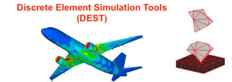

.. _DEST configuration and build:

.. DEST configuration and build
.. ============

DEST configuration and build
===================

In the following we will provide an example on how to configure and build Nektar++ on a remote machine.

DEST on ARCHER2
===================

After being successfully logged into the cluster, first export the following and load modules:

    .. code-block:: console
		
		export CRAY_ADD_RPATH=yes
                module swap PrgEnv-cray PrgEnv-gnu 
                module load cray-fftw
		module load cmake
		
Custom Environments 
==================

Regardless of the existing python environment on the HPC/local system, you need to setup a custom Python environment including packages that are not in the central installation, the simplest approach here would be the installation of Miniconda locally in your own directories.

Installing Miniconda
==================
.. image:: ../../images/ac.png
   :alt: Miniconda
   :target: https://docs.conda.io/en/latest/miniconda.html
   :class: with-shadow
   :scale: 30

First, you should download Miniconda (links to the various miniconda versions on the Miniconda website: https://docs.conda.io/en/latest/miniconda.html)

.. Note:: If you wish to use Python on the Archer2's compute nodes then you must install Miniconda in your /work directories as these are the only ones visible on the compute nodes.

Once you have downloaded the installer, you can run it. 
For example:

    .. code-block:: console
		
		user@login*:~> bash Miniconda3-latest-Linux-x86_64.sh
		
After you have installed Miniconda and setup your environment to access it, you can install whatever packages you wish using the conda install ... command. 
For example: 
    .. code-block:: console
		
		(base)user@login*:~> conda install somepy

Enter the work directory (/work) and clone the Nektar++ code into a folder, e.g. nektarpp

    .. code-block:: console
		
		cd /work/e01/e01/mlahooti
                git clone https://gitlab.DEST 

After the code is cloned, enter the nektarpp folder, make a build directory and enter it
    .. code-block:: console
		
		cd nektarpp
                mkdir build
                cd build

From within the build directory, run the configure command. Note the use of CC and CXX to select the special ARCHER-specific compilers.
    .. code-block:: console
		
	CC=cc CXX=CC cmake -DNEKTAR_USE_SYSTEM_BLAS_LAPACK=OFF -DNEKTAR_USE_MPI=ON -DNEKTAR_USE_HDF5=ON -DNEKTAR_USE_FFTW=ON -DTHIRDPARTY_BUILD_BOOST=ON -DTHIRDPARTY_BUILD_HDF5=ON ..

cc and CC are the C and C++ wrappers for the Cray utilities and determined by the PrgEnv module.
SYSTEM_BLAS_LAPACK is disabled since, by default, we can use the libsci package which contains an optimized version of BLAS and LAPACK and not require any additional arguments to cc.
HDF5 is a better output option to use on ARCHER2 since often we run out of the number of files limit on the quota. Setting this option from within ccmake has led to problems however so make sure to specify it on the cmake command line as above. Further, the HDF5 version on the ARCHER2 is not supported at the moment, so here it is built as a third-party library.
They are currently not using the system boost since it does not appear to be using C++11 and so causing compilation errors.
At this point you can run ccmake .. to e.g. disable unnecessary solvers. Now run make as usual to compile the code

    .. code-block:: console
		
		make -j 4 install

For more detailed approach please visit:
    .. code-block:: console
		
		https://www.DEST
    

DEST on ARC
===================

After being successfully logged into the cluster, first export the following and load modules:

    .. code-block:: console
		
		export CRAY_ADD_RPATH=yes
                module swap PrgEnv-cray PrgEnv-gnu 
                module load cray-fftw
		module load cmake

Custom Environments 
==================

Regardless of the existing python environment on the HPC/local system, you need to setup a custom Python environment including packages that are not in the central installation, the simplest approach here would be the installation of Miniconda locally in your own directories.

Installing Miniconda
==================
.. image:: ../../images/ac.png
   :alt: Miniconda
   :target: https://docs.conda.io/en/latest/miniconda.html
   :class: with-shadow
   :scale: 30

First, you should download Miniconda (links to the various miniconda versions on the Miniconda website: https://docs.conda.io/en/latest/miniconda.html)

.. Note:: If you wish to use Python on the Archer2's compute nodes then you must install Miniconda in your /work directories as these are the only ones visible on the compute nodes.

Once you have downloaded the installer, you can run it. 
For example:

    .. code-block:: console
		
		user@login*:~> bash Miniconda3-latest-Linux-x86_64.sh
		
After you have installed Miniconda and setup your environment to access it, you can install whatever packages you wish using the conda install ... command. 
For example: 
    .. code-block:: console
		
		(base)user@login*:~> conda install somepy
		
Enter the work directory (/work) and clone the Nektar++ code into a folder, e.g. nektarpp

    .. code-block:: console
		
		cd /work/e01/e01/mlahooti
                git clone https://gitlab.DEST 

After the code is cloned, enter the nektarpp folder, make a build directory and enter it
    .. code-block:: console
		
		cd nektarpp
                mkdir build
                cd build

From within the build directory, run the configure command. Note the use of CC and CXX to select the special ARCHER-specific compilers.
    .. code-block:: console
		
	CC=cc CXX=CC cmake -DNEKTAR_USE_SYSTEM_BLAS_LAPACK=OFF -DNEKTAR_USE_MPI=ON -DNEKTAR_USE_HDF5=ON -DNEKTAR_USE_FFTW=ON -DTHIRDPARTY_BUILD_BOOST=ON -DTHIRDPARTY_BUILD_HDF5=ON ..

cc and CC are the C and C++ wrappers for the Cray utilities and determined by the PrgEnv module.
SYSTEM_BLAS_LAPACK is disabled since, by default, we can use the libsci package which contains an optimized version of BLAS and LAPACK and not require any additional arguments to cc.
HDF5 is a better output option to use on ARCHER2 since often we run out of the number of files limit on the quota. Setting this option from within ccmake has led to problems however so make sure to specify it on the cmake command line as above. Further, the HDF5 version on the ARCHER2 is not supported at the moment, so here it is built as a third-party library.
They are currently not using the system boost since it does not appear to be using C++11 and so causing compilation errors.
At this point you can run ccmake .. to e.g. disable unnecessary solvers. Now run make as usual to compile the code

    .. code-block:: console
		
		make -j 4 install

For more detailed approach please visit:
    .. code-block:: console
		
		https://www.DEST
		
		
DEST on Cloud Computing Platforms
===================

Amazon Web Services (AWS)
-------------------------

After being successfully logged into the cluster, first export the following and load modules:

    .. code-block:: console
		
		export CRAY_ADD_RPATH=yes
                module swap PrgEnv-cray PrgEnv-gnu 
                module load cray-fftw
		module load cmake

Enter the work directory (/work) and clone the Nektar++ code into a folder, e.g. nektarpp

    .. code-block:: console
		
		cd /work/e01/e01/mlahooti
                git clone https://gitlab.DEST 

After the code is cloned, enter the nektarpp folder, make a build directory and enter it
    .. code-block:: console
		
		cd nektarpp
                mkdir build
                cd build

From within the build directory, run the configure command. Note the use of CC and CXX to select the special ARCHER-specific compilers.
    .. code-block:: console
		
	CC=cc CXX=CC cmake -DNEKTAR_USE_SYSTEM_BLAS_LAPACK=OFF -DNEKTAR_USE_MPI=ON -DNEKTAR_USE_HDF5=ON -DNEKTAR_USE_FFTW=ON -DTHIRDPARTY_BUILD_BOOST=ON -DTHIRDPARTY_BUILD_HDF5=ON ..

cc and CC are the C and C++ wrappers for the Cray utilities and determined by the PrgEnv module.
SYSTEM_BLAS_LAPACK is disabled since, by default, we can use the libsci package which contains an optimized version of BLAS and LAPACK and not require any additional arguments to cc.
HDF5 is a better output option to use on ARCHER2 since often we run out of the number of files limit on the quota. Setting this option from within ccmake has led to problems however so make sure to specify it on the cmake command line as above. Further, the HDF5 version on the ARCHER2 is not supported at the moment, so here it is built as a third-party library.
They are currently not using the system boost since it does not appear to be using C++11 and so causing compilation errors.
At this point you can run ccmake .. to e.g. disable unnecessary solvers. Now run make as usual to compile the code

    .. code-block:: console
		
		make -j 4 install

For more detailed approach please visit:
    .. code-block:: console
		
		https://www.DEST	

DEST on Local Machine
==================

How to build and run on Windows
=====================

Requirement:

How to build and run on macOS
=====================

Requirement: 

Add public ssh key to Gitlab server 

/bin/bash -c "$(curl -fsSL https://raw.githubusercontent.com/Homebrew/install/HEAD/install.sh)" 

brew update 

brew install llvm libomp 

brew install cmake 

Git clone "http://isml-grs.eng.ox.ac.uk:8000/DEST/DEST.git"  

 

Compile 

cd DEST/BIN 

cmake -DCMAKE_C_COMPILER="/usr/local/opt/llvm/bin/clang" -DCMAKE_CXX_COMPILER="/usr/local/opt/llvm/bin/clang++" .. 

make -j 12 

 

Test  

./ANALYSER_ -filename ../TESTS/B_005/B_005.dat 

How to build and run on Linux
=====================

Requirement: 

