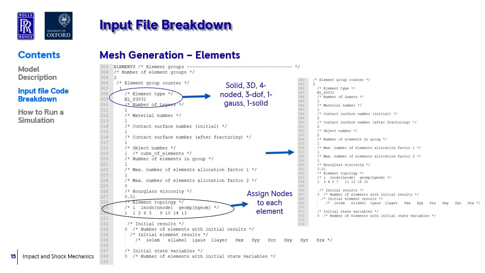
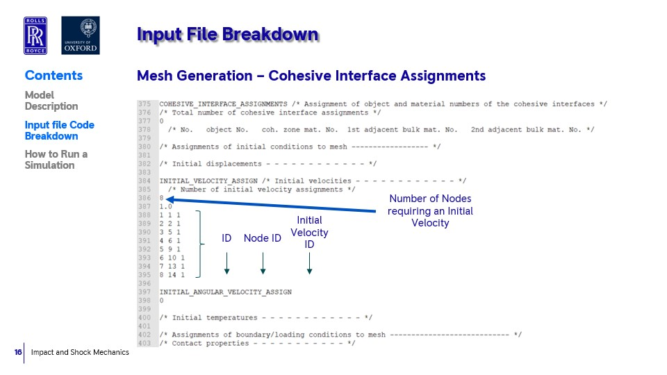

.. _darcoms:

.. darcoms
.. ============

DEST darcoms
==============

Introduction
------------

- DARCoMS Input file (.dms)
- DARCoMS Workflow
- DARCoMS Benchmarks

DARCOMS Input file
==============

   
...................

   

DARCoMS Workflow
==============

Visual explanation of the concept
---------------------------------

.. image:: ../../images/DEST_data_flow.jpg
   :alt: modelinputs
   :class: with-shadow
   :scale: 100
   

DEST flowchart
==============

.. image:: ../../images/Slide1.jpg
   :alt: flowchar1
   :align: center
   :class: with-shadow
   :scale: 50
 
...................

.. image:: ../../images/Slide2.jpg
   :alt: flowchar2
   :align: center
   :class: with-shadow
   :scale: 50
 
