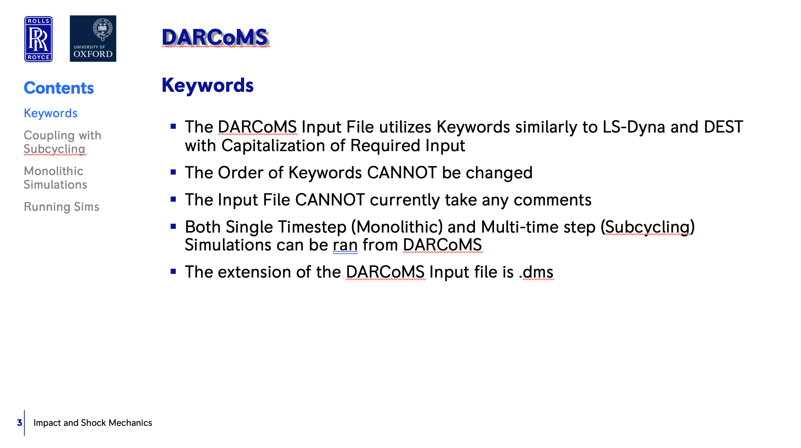
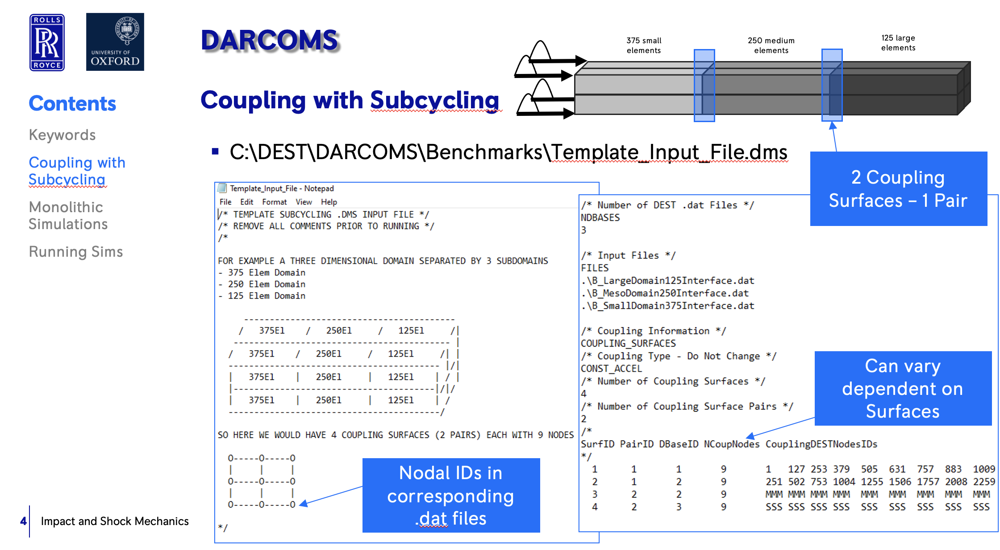
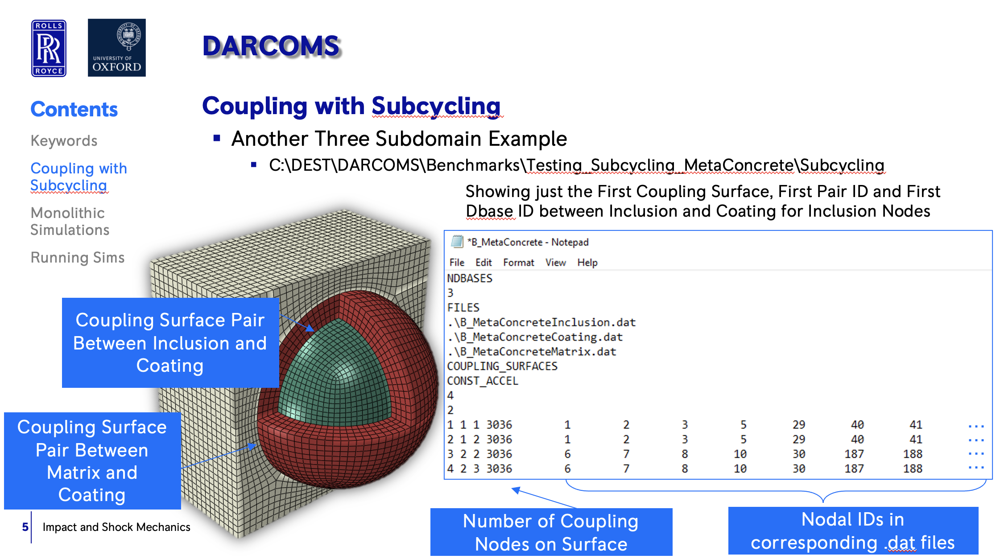
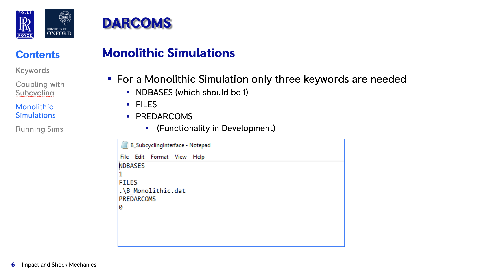
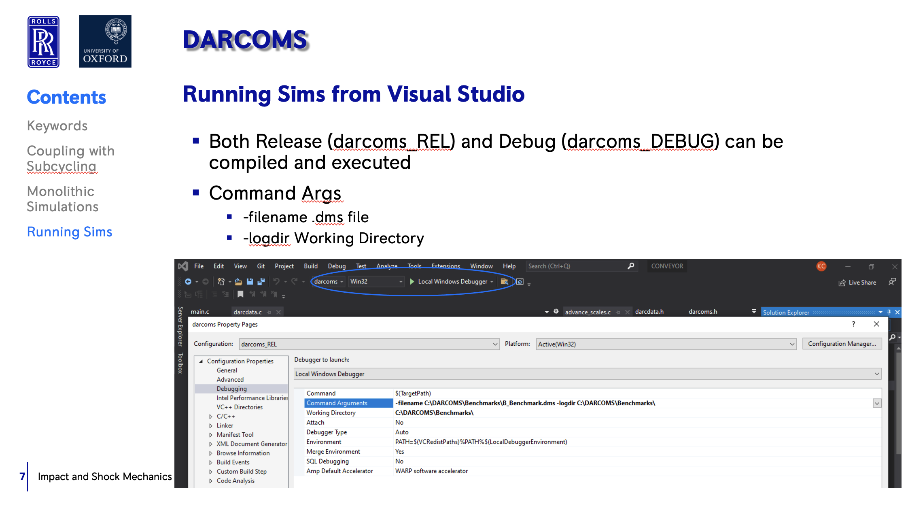
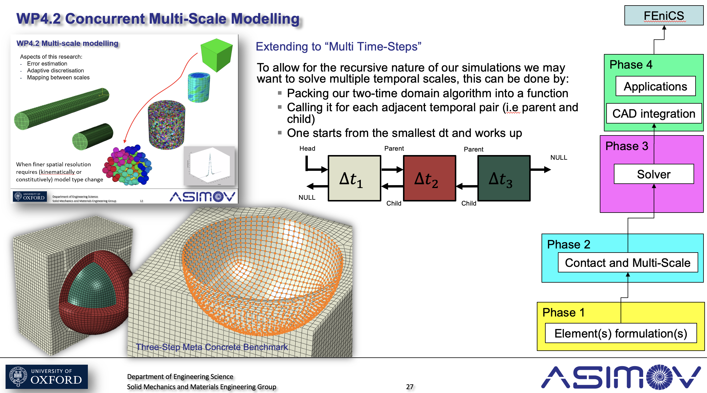

.. _darcoms:

.. darcoms
.. ============

DEST darcoms
==============

Introduction
------------

- DARCoMS Input file (.dms)
- DARCoMS Workflow
- DARCoMS Benchmarks

DARCOMS Input file
==============

.. image:: ../../images/darcoms1.jpg
   :alt: darc1
   :align: center
   :class: with-shadow
   :scale: 50  
   
...................

   
...................     

   
...................

   
...................     

   
...................

   

DARCoMS Development
==============

Visual explanation of the concept
---------------------------------

.. image:: ../../images/darcoms7.jpg
   :alt: darc7
   :class: with-shadow
   :scale: 50
   

DARCoMS Benchmarks
==============

 

 
