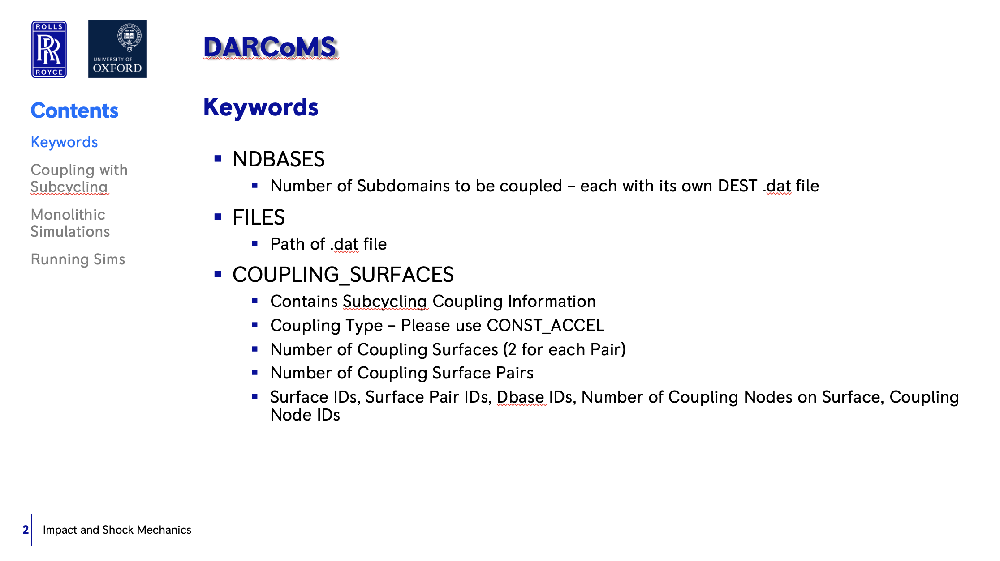
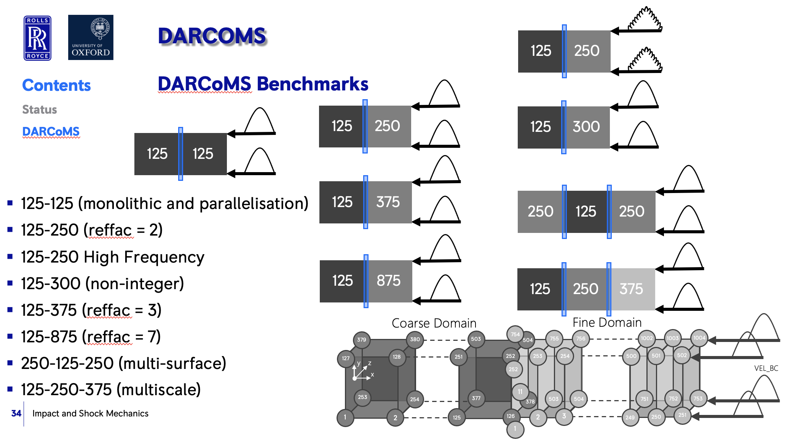

.. _darcoms:

.. darcoms
.. ============

DEST darcoms
==============

Introduction
------------

- DARCoMS Input file (.dms)
- DARCoMS Workflow
- DARCoMS Benchmarks

DARCOMS Input file
==============

   
...................

   
...................     

   
...................

   
...................     

   
...................

   

DARCoMS Development
==============

Visual explanation of the concept
---------------------------------

   

DARCoMS Benchmarks
==============

 

 
