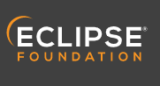
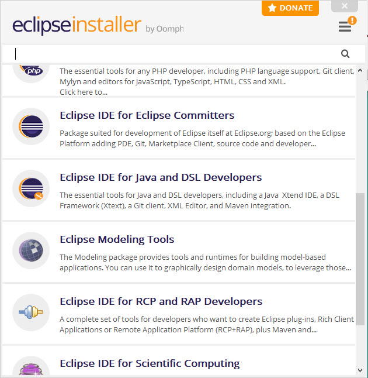

.. _execution:

Integrated Development Environment (IDE)
=======================
This document briefly details how user/developers can  use C/C++ integrated development environments (C/C++ IDEs) that provide a comprehensive set of tools for DEST development, in the C and/or C++ programming languages

How to build and run on Visual Studio 
=======================

Currently the only IDE that can generate all three executables (DEST_analyser, DEST_optimiser and DEST_conveyor) for Windows. 

The "make" (as an older version of "cmake") approach to compiling and linking the code on all platforms should also work, but needs updating to ensure that is works (rather than just on Linux) on Windows and macOS. 	

How to build and run on Visual Studio Code 
=====================

Visual Studio Code download 

Visual Studio Code Docs Documentation for Visual Studio Code, including Getting Started videos Visual Studio Code Introductory Videos 

Open DEST repository (http://isml-grs.eng.ox.ac.uk:8000) 

How to build and run on Eclipse 
=======================

Installing Eclipse 
==================

First, you should download and install your favorite desktop IDE packages (links to the various Eclipse versions on the Eclipse website: https://www.eclipse.org/downloads/)

Once you have downloaded the installer, you can run Eclipse installer.

.. Note:: For more detailed approch visit https://www.eclipse.org/downloads/packages/installer

then select Eclipse IDE for Scientific Computing and install it:

   
   
    .. code-block:: console
		
	              	Package Description
                  Tools for C, C++, Fortran, and UPC, including MPI, OpenMP, OpenACC, a parallel debugger, and remotely building, running and monitoring applications.

                  This package includes:
                      C/C++ Development Tools
                      Git integration for Eclipse
                      Mylyn Task List
                      Parallel Tools Platform
                      Eclipse XML Editors and Tools	

How to build and run on CLion 
=======================

Currently the only IDE that can generate all three executables (DEST_analyser, DEST_optimiser and DEST_conveyor) for Windows. 

The "make" (as an older version of "cmake") approach to compiling and linking the code on all platforms should also work, but needs updating to ensure that is works (rather than just on Linux) on Windows and macOS. 	
