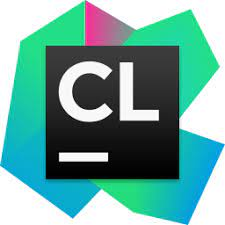

.. _execution:

Integrated Development Environment (IDE)
=======================
This document briefly details how user/developers can  use C/C++ integrated development environments (C/C++ IDEs) that provide a comprehensive set of tools for DEST development, in the C and/or C++ programming languages

How to build and run on Visual Studio 
=======================

Currently the only IDE that can generate all three executables (DEST_analyser, DEST_optimiser and DEST_conveyor) for Windows. 

Installing Visual Studio  
==================

First, you should download and install your favorite desktop IDE packages (links to the various Visual Studio versions on the Visual Studio website: https://visualstudio.microsoft.com/free-developer-offers/)

Once you have downloaded the installer, you can run the installer.

.. Note:: For more detailed approach visit https://visualstudio.microsoft.com/free-developer-offers/ 	

start Visual Studio and click on Switch between solutions and available views

 .. image:: ../../images/win-images/8x.png
   :alt: win8x
   :align: center
   :class: with-shadow
   :scale: 50

.. Note:: Assuming you have followed the steps in https://dest-doc.readthedocs.io/en/latest/DESTconfigurationandbuild.html#how-to-build-and-run-on-windows

you will see then the following figure, select analyser.sln and then OK

 .. image:: ../../images/win-images/16.png
   :alt: win16
   :align: center
   :class: with-shadow
   :scale: 50
  
then right click on solution explorer and select Rebuild solution  
  
 .. image:: ../../images/win-images/17.png
   :alt: win17
   :align: center
   :class: with-shadow
   :scale: 50

After everything done you will see the following

 .. image:: ../../images/win-images/18.png
   :alt: win18
   :align: center
   :class: with-shadow
   :scale: 50

next right click on solution explorer and select properties

 .. image:: ../../images/win-images/19.png
   :alt: win19
   :align: center
   :class: with-shadow
   :scale: 50

then enter the arguments for DEST (e.g. -filename   /home/kevinb/Videos/DEST-master/src/TESTS/B_013/B_013.dat) [apply and close]

 .. image:: ../../images/win-images/21.png
   :alt: win21
   :align: center
   :class: with-shadow
   :scale: 50

now you can run the solver

 .. image:: ../../images/win-images/22.png
   :alt: win22
   :align: center
   :class: with-shadow
   :scale: 50

How to build and run on Visual Studio Code 
=====================

Installing Visual Studio Code 
==================

First, you should download and install your favorite desktop IDE packages (links to the various Visual Studio Code versions on the Visual Studio Code website: https://code.visualstudio.com/)

Once you have downloaded the installer, you can run the installer.

.. Note:: For more detailed approach visit https://code.visualstudio.com/docs [Visual Studio Code Docs Documentation for Visual Studio Code, including Getting Started videos Visual Studio Code Introductory Videos] 

Next, enter the work directory (your working directory) and clone the DEST code into a folder, e.g. DEST-master

    .. code-block:: console
		
		cd yourwork
                git clone https://gitlab.DEST_master 

After the code is cloned, start Visual Studio Code, and select open folder, and choose the root directory DEST

 .. image:: ../../images/vsc2.png
   :alt: VSC2
   :align: center
   :class: with-shadow
   :scale: 80

click on yes, I trust authors (of the code)

 .. image:: ../../images/vsc3.png
   :alt: VSC3
   :align: center
   :class: with-shadow
   :scale: 80

now you will be able to see DEST project inside Visual Studio Code-IDE. Next you need to install the following extensions in visual studio code

 .. image:: ../../images/vsc0.png
   :alt: VSC0
   :align: center
   :class: with-shadow
   :scale: 60

then click on build button as shown in figure

 .. image:: ../../images/vsc4.png
   :alt: VSC4
   :align: center
   :class: with-shadow
   :scale: 80

select [unspecified] let CMake guess what compiler and environment to use

 .. image:: ../../images/vsc5.png
   :alt: VSC5
   :align: center
   :class: with-shadow
   :scale: 60

configuring and generating and build will be done (the executable file in ../DEST-master/src/BIN), as shown in figure

 .. image:: ../../images/vsc6.png
   :alt: VSC6
   :align: center
   :class: with-shadow
   :scale: 60  

next you need to create a launch json file (this will create a folder with the name .vscode and a file within with the name launch.json)

 .. image:: ../../images/vsc7.png
   :alt: VSC7
   :align: center
   :class: with-shadow
   :scale: 60 

then you need to modify the json file as follows

        .. code-block:: bash
	
                {
                // Use IntelliSense to learn about possible attributes.
                // Hover to view descriptions of existing attributes.
                // For more information, visit: https://go.microsoft.com/fwlink/?linkid=830387
                "version": "0.2.0",
                 "configurations": [
  
                {
                "name": "(gdb) Launch",
                "type": "cppdbg",
                "request": "launch",
                "program": "${workspaceFolder}/BIN/DEST_analyser_Debug",
                "args": ["-filename","yours/DEST-master/src/TESTS/B_013/B_013.dat"],  <-- need to be modified!
                "stopAtEntry": false,
                "cwd": "${fileDirname}",
                "environment": [],
                "externalConsole": false,
                "MIMode": "gdb",
                "setupCommands": [
                {
                    "description": "Enable pretty-printing for gdb",
                    "text": "-enable-pretty-printing",
                    "ignoreFailures": true
                },
                {
                    "description":  "Set Disassembly Flavor to Intel",
                    "text": "-gdb-set disassembly-flavor intel",
                    "ignoreFailures": true
                    }
                   ]
                  }, 
                 ]
                }
		
next go run --> debugging or press F5  and you will see that the solver will start running as shown in figure

 .. image:: ../../images/vsc8.png
   :alt: VSC8
   :align: center
   :class: with-shadow
   :scale: 60
   
you are now able to run and debug the code using Visual Studio Code-IDE.   

How to build and run on Eclipse 
=======================

Installing Eclipse 
==================
.. image:: ../../images/eclipse1.png
   :alt: Eclipse1 
   :target: https://www.eclipse.org/downloads/
   :class: with-shadow
   :scale: 100

First, you should download and install your favorite desktop IDE packages (links to the various Eclipse versions on the Eclipse website: https://www.eclipse.org/downloads/)

Once you have downloaded the installer, you can run Eclipse installer.

.. Note:: For more detailed approach visit https://www.eclipse.org/downloads/packages/installer

then select Eclipse IDE for Scientific Computing and install it:

 .. image:: ../../images/eclipse2.png
   :alt: Eclipse2
   :align: center
   :class: with-shadow
   :scale: 80
   

Package Description:

           .. code-block:: console
		
	              	
                  Tools for C, C++, Fortran, and UPC, including MPI, OpenMP, OpenACC, a parallel debugger, and remotely building, running and monitoring applications.

                  This package includes:
                      C/C++ Development Tools
                      Git integration for Eclipse
                      Mylyn Task List
                      Parallel Tools Platform
                      Eclipse XML Editors and Tools	

Next, enter the work directory (your working directory) and clone the DEST code into a folder, e.g. DEST-master

    .. code-block:: console
		
		cd yourwork
                git clone https://gitlab.DEST_master 

After the code is cloned, enter your work folder, make a build directory outside DEST folder and enter it
    .. code-block:: console
		mkdir Build
		cd Build

From within the build directory, run the configure command (with updated path!). Note the use of CC and CXX to select the special compilers.

    .. code-block:: console
		
	cmake -G "Eclipse CDT4 - Ninja"   -DCMAKE_BUILD_TYPE:STRING="Debug" -DCMAKE_INSTALL_PREFIX:PATH="/home/kevinb/Videos/DEST-master/src/Install"  -DCMAKE_C_COMPILER="/usr/bin/cc"  -DCMAKE_CXX_COMPILER="/usr/bin/c++"  /home/kevinb/Videos/DEST-master/src/CMakeLists.txt
	
If configuring and generating using CMake were successful you will see something similar to the following:

 .. image:: ../../images/eclipse3.png
   :alt: Eclipse3
   :align: center
   :class: with-shadow
   :scale: 80

At this point you can run cmake .. to e.g. disable unnecessary solvers, then run cmake as usual to build the code (with updated path!)

    .. code-block:: console
		
		cmake --build /home/kevinb/Videos/Build  --clean-first  --config Debug -- "-v"

Finally, if building using CMake was successful you will see something similar to the following:

 .. image:: ../../images/eclipse4.png
   :alt: Eclipse4
   :align: center
   :class: with-shadow
   :scale: 80

Then check the executable file in ../DEST-master/src/BIN

    .. code-block:: console
    
		file DEST_analyser_Debug

For testing the executable file you can run the following:
    .. code-block:: console
		
		./DEST_analyser_Debug   -filename ../TESTS/B_013/B_013.dat

Now you can start Eclipse and select/create a directory as eclipse-workspace:	
  
 
 .. image:: ../../images/eclipse5.png
   :alt: Eclipse5
   :align: center
   :class: with-shadow
   :scale: 90
   
   
then click on import a project with working Makefile

 .. image:: ../../images/eclipse6.png
   :alt: Eclipse6
   :align: center
   :class: with-shadow
   :scale: 70
 

fill the project name, existing code location, etc. click on finish button as shown in figure

 .. image:: ../../images/eclipse7.png
   :alt: Eclipse7
   :align: center
   :class: with-shadow
   :scale: 70

now you will be able to see DEST project inside Eclipse-IDE. To view or edit the project's properties, right-click the project and select Properties and then select C/C++ build and fill it as follows (note that ninja should be already installed on system) [apply and close]
 
 
 .. image:: ../../images/eclipse8.png
   :alt: Eclipse8
   :align: center
   :class: with-shadow
   :scale: 60
   

right-click the project again and select debug configurations and change it as the follows [apply and close]

 
 .. image:: ../../images/eclipse9.png
   :alt: Eclipse9
   :align: center
   :class: with-shadow
   :scale: 60

on the same window click Arguments and enter the arguments for DEST (e.g. -filename   /home/kevinb/Videos/DEST-master/src/TESTS/B_013/B_013.dat) [apply and close]

 .. image:: ../../images/eclipse10.png
   :alt: Eclipse10
   :align: center
   :class: with-shadow
   :scale: 60
   
   
   
   
to configure run, right-click the project again and select run configurations and change it as the follows [apply and close]

 .. image:: ../../images/eclipse11.png
   :alt: Eclipse11
   :align: center
   :class: with-shadow
   :scale: 60
   
   
finally, click on run button and you will see that the solver will start running
 
 
 .. image:: ../../images/eclipse12.png
   :alt: Eclipse12
   :align: center
   :class: with-shadow
   :scale: 60

you are now able to run and debug the code using Eclipse-IDE.
   
How to build and run on CLion 
=======================

Installing CLion
==================

First, you should download and install your favorite desktop IDE packages (links to the various CLion versions on the CLion website: https://www.jetbrains.com/clion/)

Once you have downloaded the installer, you can run the installer.

.. Note:: For more detailed approach visit https://www.jetbrains.com/clion/ 

Next, enter the work directory (your working directory) and clone the DEST code into a folder, e.g. DEST-master

    .. code-block:: console
		
		cd yourwork
                git clone https://gitlab.DEST_master 

After the code is cloned, start CLion and select open (folder), and choose the root directory DEST 

 .. image:: ../../images/cl1.png
   :alt: CL1
   :align: center
   :class: with-shadow
   :scale: 90

click on next

 .. image:: ../../images/cl2.png
   :alt: CL2
   :align: center
   :class: with-shadow
   :scale: 50
   
   
click on finish

 .. image:: ../../images/cl3.png
   :alt: CL3
   :align: center
   :class: with-shadow
   :scale: 50
   
as shown in the following figure select Edit Configuration

 .. image:: ../../images/cl4.png
   :alt: CL4
   :align: center
   :class: with-shadow
   :scale: 50

enter the arguments for DEST as shown in the following figure:
    .. code-block:: console
		
		-filename  path to/TESTS/B_013/B_013.dat

 .. image:: ../../images/cl5.png
   :alt: CL5
   :align: center
   :class: with-shadow
   :scale: 50   

you are now able to run and debug the code using CLion-IDE.

 .. image:: ../../images/cl6.png
   :alt: CL6
   :align: center
   :class: with-shadow
   :scale: 50     
